# 线索猎手｜產品介紹與使用說明

> **讓公開表達的購車需求，成為門店可以發現、理解和跟進的銷售機會。**
>
> 面向汽車經銷商、門店負責人、DCC 團隊與銷售顧問 · 圖文版

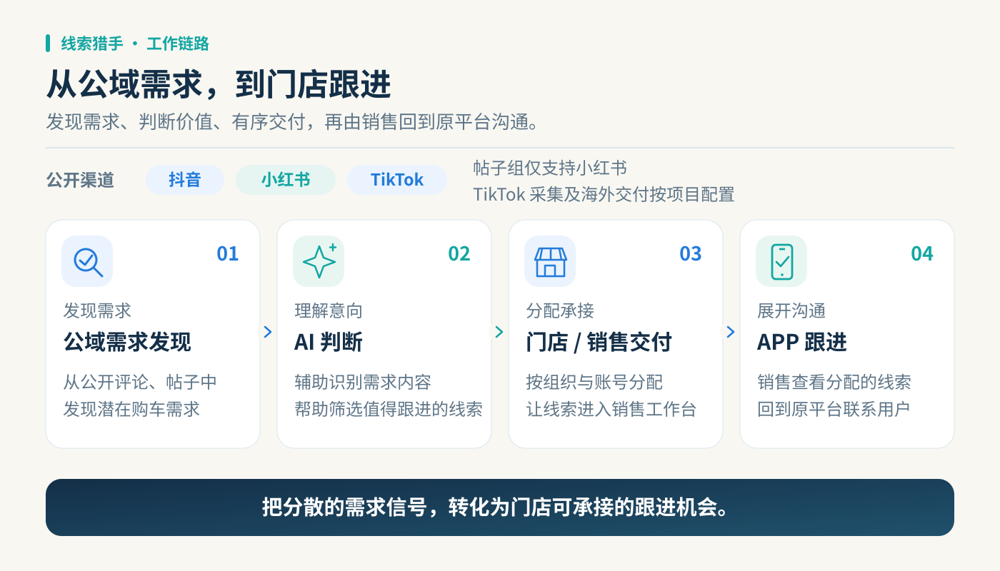

*圖 01｜產品全景：從公開評論、帖子中發現需求，經 AI 判斷和後台分配，交付銷售在 APP 中查看，再回到原平台開展溝通。*

**快速入口**：[產品官網](https://leadshunter.lancloudtech.com/) · [线索猎手後台](https://aliyun-control-pannel-leadshunter.lancloudtech.com/) · [APP 應用商店](https://appstore.lancloudtech.com/app?id=leadshunter) · [聯繫銷售經理](https://leadshunter-contact.lancloudtech.com/)

## 閱讀導覽

- [1. 线索猎手是什麼](#what)
- [2. 為什麼有 DCC 和汽車垂媒，還需要线索猎手](#why)
- [3. 如何擴大經銷商的線索入口](#channels)
- [4. 後台怎麼用：配置、識別、指派與分發](#console)
- [5. APP 怎麼用：查看、篩選、提醒與跟進](#app)
- [6. 合作夥伴與使用效果](#partners) · [長沙小鵬直營一個月案例](#changsha-case)
- [7. 日常使用清單與常見問題](#faq)
- [8. 聯繫銷售經理](#contact)

目前產品版本：**APP 3.0.0 · 控制台 2.3.1**。安裝管道的具體建置與可用狀態，以應用商店頁面為準。

## 1. 线索猎手是什麼

**线索猎手（线索猎手）是一套面向汽車經銷商和銷售團隊的公域獲客與線索交付工具。** 它幫助門店在抖音、小紅書等公開內容中尋找購車需求，用 AI 判斷意向、整理上下文和跟進建議，再把適合處理的線索分配給門店與銷售顧問。

潛在客戶的需求，往往已經寫在公開內容裡：有人在評論區問「長沙落地多少」，有人詢問現車、置換或試駕，也有人直接發帖尋找銷售、比較車型。线索猎手把這些分散的需求表達整理成可閱讀、可篩選、可分配的工作對象。

| 門店關心的問題 | 线索猎手提供的資訊或能力 |
|---|---|
| 哪裡還有客戶需求？ | 關鍵詞搜尋、目標帳號作品評論、使用者主動發布的需求帖子 |
| 哪些值得優先看？ | 高意向、中意向等 AI 判斷及其理由 |
| 客戶到底問了什麼？ | 評論原文、帖子標題、正文與來源連結 |
| 應該交給誰處理？ | 組織歸屬、組織指派、帳號分發與接收帳號配置 |
| 銷售下一步怎麼做？ | APP 查看詳情、參考建議動作、前往使用者主頁或原帖溝通 |

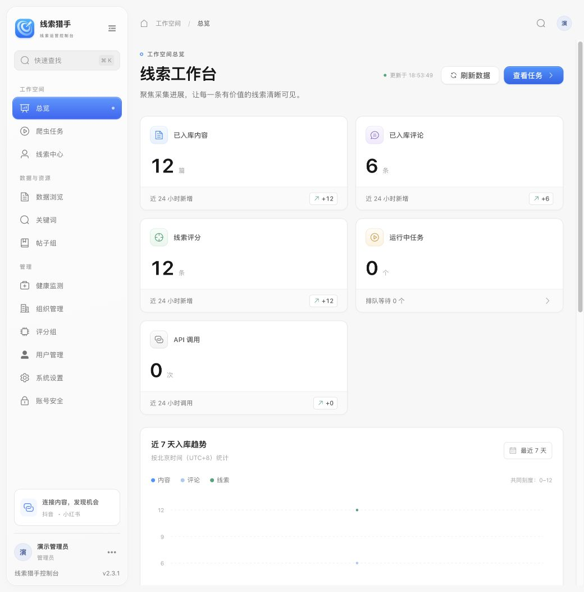

*圖 02｜後台總覽：上方展示內容、評論、評分和任務概況，中部展示意向分佈，下方展示抓取趨勢，幫助營運人員掌握需求分佈與處理進度。*

### 一套產品，兩種工作介面

**後台是營運與分配的工作臺。** 管理人員配置關注什麼、屬於哪家門店、誰接收線索，並檢查採集和交付過程。

**APP 是銷售顧問的隨身線索工作臺。** 銷售查看分給自己的有效線索，按意向與狀態安排優先順序，讀懂客戶需求後回到原平台跟進。

线索猎手幫助門店發現需求、理解意向並安排跟進；銷售顧問結合客戶原話，繼續完成溝通、報價、邀約和成交。

## 2. 為什麼有 DCC 和汽車垂媒，還需要线索猎手

**因為客戶在走到留資、接聽電話和預約到店之前，已經在社交平台表達了大量需求。** 线索猎手為門店增加一個發現這些需求的入口，讓原有獲客與承接體系有機會覆蓋更早的購車討論階段。

汽車垂媒帶來諮詢與留資，DCC 團隊負責溝通、培育和邀約。线索猎手補充抖音、小紅書等社交平台上的需求發現，讓門店在客戶主動留資之前就有機會建立聯繫。

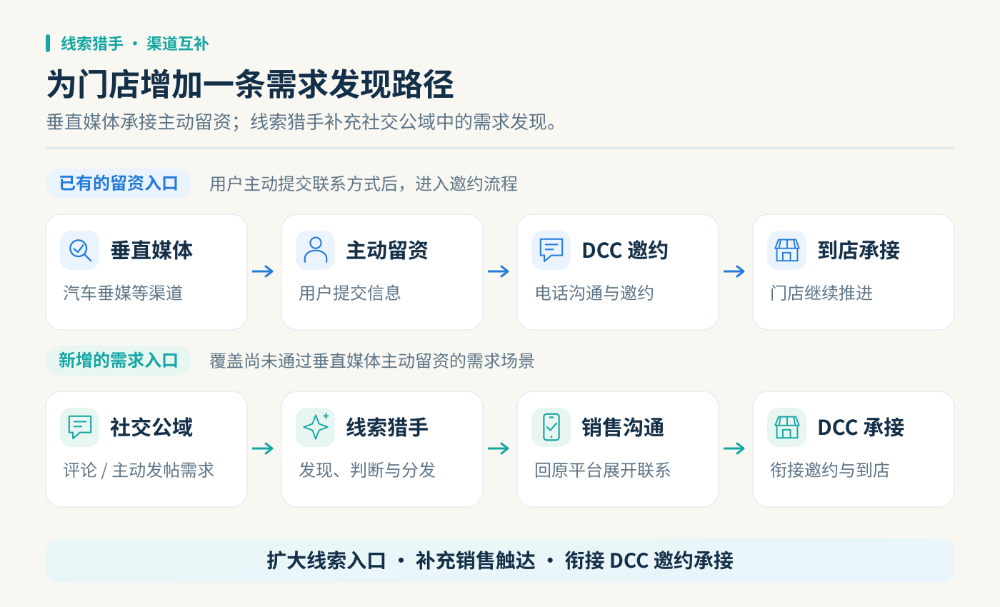

*圖 03｜兩條入口協同：既有渠道繼續承接主動留資，线索猎手補充公域需求發現；銷售與 DCC 按門店流程完成溝通和邀約。*

| 維度 | 汽車垂媒等既有渠道 | 线索猎手補充的能力 | DCC / 銷售承接 |
|---|---|---|---|
| 發現需求的位置 | 車型內容、諮詢、詢價與留資路徑 | 社交平台公開評論和主動發帖 | 根據客戶需求繼續溝通 |
| 典型需求表達 | 提交諮詢、預約或聯繫方式 | 「多少錢落地」「有沒有現車」「求推薦銷售」 | 核實車型、預算、地區和購車計畫 |
| 交給門店的資訊 | 諮詢、詢價與客戶留資資訊 | 公開原文、來源上下文、意向判斷和建議動作 | 報價、邀約、到店與後續跟進 |
| 對經營的作用 | 持續承接已有渠道需求 | 擴大可發現的人群與討論場景 | 把機會推進為有效商機 |

### 對門店最直接的三個價值

1. **增加發現機會的地方。** 在客戶尚未給本店留資時，也能發現其公開表達的需求。
2. **讓溝通更有上下文。** 銷售先知道客戶在問哪個車型、什麼問題，再準備回應。
3. **幫助安排跟進順序。** 從大量內容中篩出高、中意向候選，結合日期和待跟進狀態安排工作。

例如，面對一條「落地多少 長沙」的評論，銷售可以先透過原帖了解客戶關注的車型，準備本地報價與現車資訊，再圍繞客戶的問題展開溝通。**帶著上下文聯繫客戶，讓每次跟進更有針對性。**

> **長沙小鵬直營使用案例：** 兩家門店、4 名銷售在一個月的跟進台帳中記錄了 **174 條跟進、62 條客戶回覆、36 條取得聯繫方式，以及 3 條鎖單反饋**。[查看門店使用效果](#changsha-case)。

## 3. 如何擴大經銷商的線索入口

### 3.1 從「品牌詞」擴展到「城市 × 車型 × 需求」

關鍵詞組讓門店把經營範圍變成可執行的搜尋主題。除了品牌名，還可以圍繞城市、車型、落地價、試駕、現車、置換等組合配置。

| 搜尋思路 | 配置示例 | 希望發現的需求 |
|---|---|---|
| 城市 + 品牌 / 車型 | 長沙 小鵬；上海 智己 | 本地或周邊購車討論 |
| 車型 + 價格 | 某車型 落地價；某車型 優惠 | 詢價、預算、成交條件 |
| 城市 + 交付需求 | 東莞 某車型 現車 | 現車、提車週期 |
| 車型 + 用車決策 | 某車型 試駕；某車型 置換 | 體驗比較、換購需求 |

營運人員可根據實際回覆與留資情況，持續優化城市、車型和需求詞的組合。

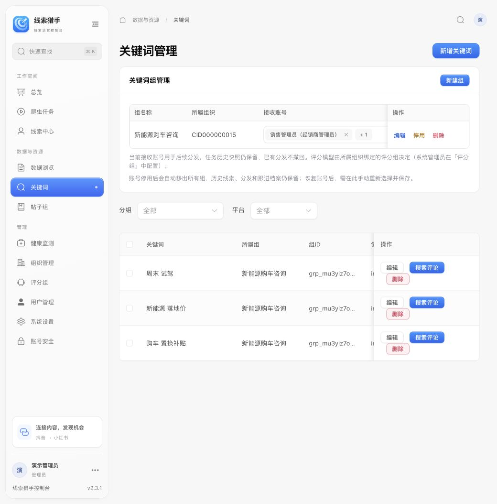

*圖 04｜關鍵詞入口：上方管理組、所屬組織和接收帳號，下方維護關鍵詞、平台及搜尋範圍。圍繞「城市 + 品牌 + 落地」等主題配置關鍵詞，啟用組後參與定時採集。*

### 3.2 從自己的內容，擴展到目標公開帳號的討論區

「競品配置」可以圍繞選定的公開帳號及其作品評論尋找需求。門店可關注與自身經營相關的車型、區域門店或汽車內容帳號，發現評論區中正在比較、諮詢和詢價的潛在客戶。

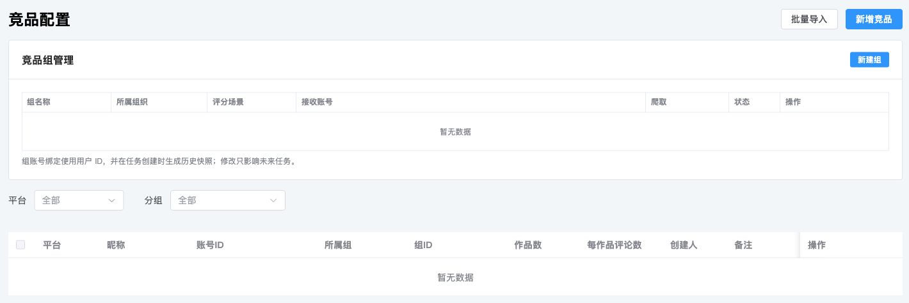

*圖 05｜競品配置：先建組，再新增目標帳號，也可透過批次匯入快速建立關注帳號清單。 （2026-09-08 歷史介面示例）*

門店可以從這些公開作品和評論中，發現本地購車、車型比較和價格諮詢等需求。

### 3.3 從評論區，擴展到主動發帖的求購人群

有些客戶不會在門店影片下留言，而是自己發帖問「有銷售嗎」「這幾款車怎麼選」「誰有現車」。帖子組用於尋找這類完整的公開需求表達。

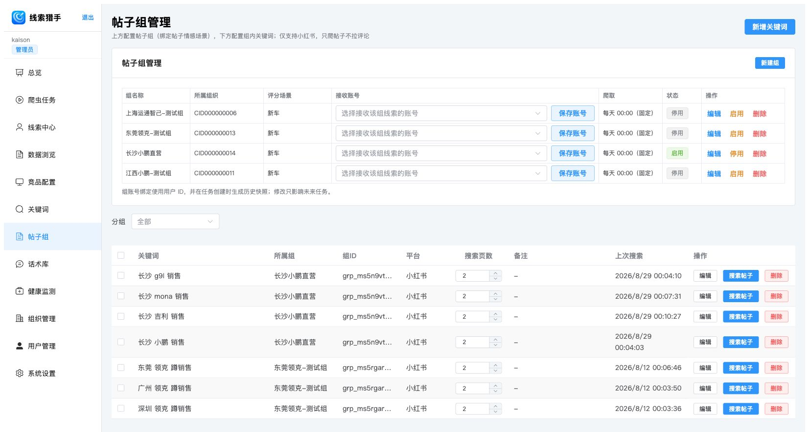

*圖 06｜帖子組入口：上方管理組與所屬組織，下方配置搜尋詞。該入口面向小紅書帖子，幫助門店尋找使用者主動發布的求購需求。 （2026-09-08 歷史介面示例）*

### 3.4 從「搜到內容」，推進到「知道為什麼值得跟進」

AI 會結合內容與上下文進行意向判斷，區分高意向、中意向、弱意向、無意向和待覆核，並盡可能提供判斷依據和建議動作。高、中意向線索會按組織配置進入自動交付流程，供銷售優先處理。

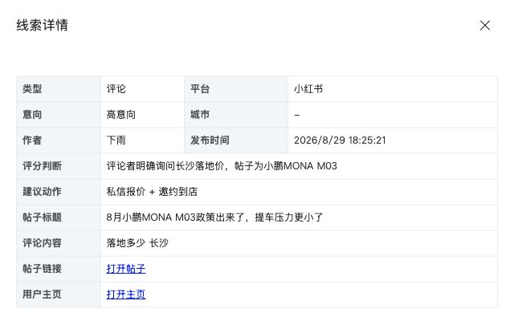

*圖 07｜AI 意向分析：結合「落地多少 長沙」的評論和小鵬 MONA M03 原帖，識別本地詢價需求，並為銷售提供「私訊報價 + 邀約到店」的跟進建議。 （2026-09-08 歷史介面示例）*

### 3.5 從「發現機會」，推進到「交給具體的人」

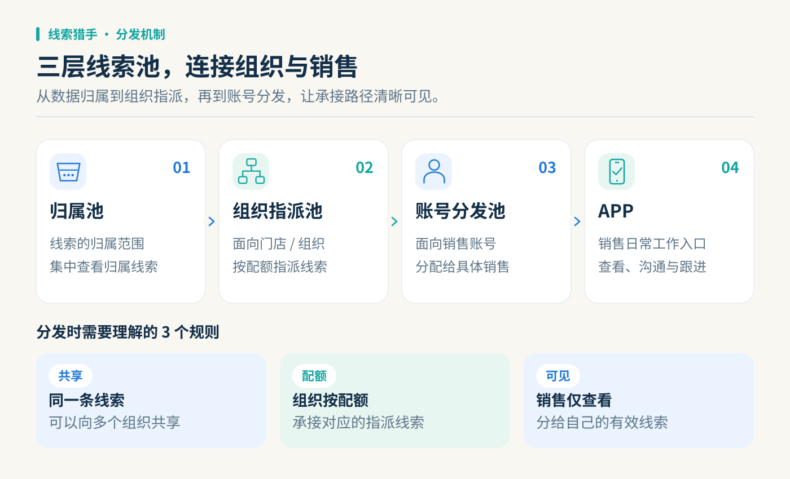

*圖 08｜三層線索池：歸屬池回答「與哪個組織相關」，組織指派池回答「已交給哪家門店」，帳號分發池回答「誰在 APP 裡能看到」。門店可據此明確線索歸屬與跟進負責人。*

配置好門店地區、每日配額和接收帳號後，管理員可在線索中心查看交付進度，銷售在 APP 中接收分給自己的線索。

### 當前平台範圍

| 能力 | 當前範圍 |
|---|---|
| 關鍵詞評論採集、競品帳號採集 | 頁面支援抖音、小紅書、TikTok；關鍵詞的「全部平台」當前指抖音與小紅書 |
| 帖子組 | 僅小紅書帖子 |
| 國內標準自動指派與分發 | 抖音評論、小紅書評論、小紅書帖子中的高 / 中意向，按組織配置執行 |
| 海外場景 | 已有 TikTok 採集入口；語言場景、意向規則與具體交付方式按海外專案配置 |

## 4. 後台怎麼用：配置、識別、指派與分發

建議首次按這個順序開通：**組織與帳號 → 建組 → 綁定接收人 → 新增關鍵詞或帳號 → 啟用採集 → 檢查線索 → APP 接收。**

### 4.1 登入後台，先確認自己的角色

使用組織分配的帳號登入[线索猎手後台](https://aliyun-control-pannel-leadshunter.lancloudtech.com/)。左側選單隨角色變化，普通銷售主要使用 APP。

| 角色 | 主要工作 | 可見範圍 |
|---|---|---|
| 系統管理員 | 配置組織、配額、帳號；檢查任務；管理線索總庫和三層池 | 平台管理範圍 |
| 經銷商管理員 | 維護本組織採集組、關鍵詞和接收人；把組織線索分給銷售 | 本組織範圍 |
| 銷售顧問 | 在 APP 閱讀線索、篩選、查看通知和跟進 | 分給自己的有效線索 |

經銷商管理員主要使用「組織指派池」和「帳號分發池」，管理本店線索與銷售接收情況。

### 4.2 系統管理員：建立組織，設定接收能力

進入 **組織管理 → 新建組織**，填寫組織名稱、銷售帳號上限、所在地等資訊，並按業務約定配置每日配額。

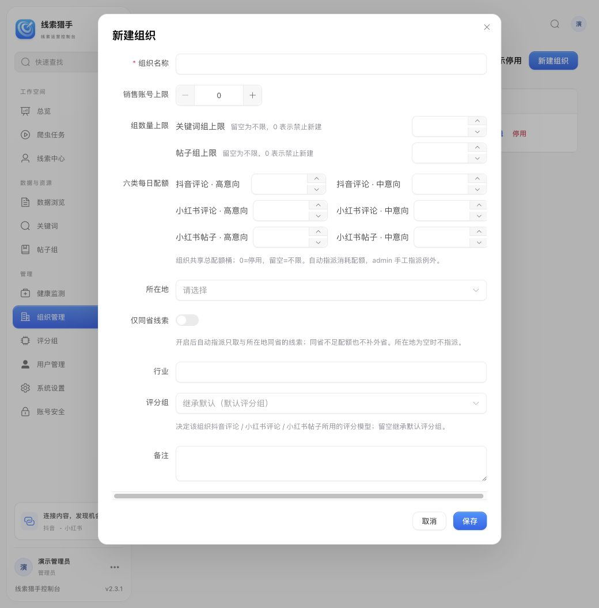

*圖 09｜組織設定：銷售帳號上限限制組織可啟用的銷售帳號數量；六類每日配額分別對應抖音評論、小紅書評論、小紅書帖子的高、中意向。*

| 設定項 | 如何理解 |
|---|---|
| 六類每日配額 | 按組織共享額度執行 |
| 配額填寫 0 | 該類自動指派停用 |
| 配額留空 | 該類不設數量上限 |
| 配額填寫正數 | 該類每日自動指派上限 |
| 僅同省線索 | 開啟後自動指派只取同省線索；不足時不補外省，所在地為空時不自動指派 |

可根據門店的銷售人數與每日承接能力設定配額，並結合跟進情況調整。

### 4.3 建立銷售帳號

進入 **使用者管理 → 新建帳號**，填寫登入名、姓名、角色、組織和密碼。銷售帳號交付給對應人員使用；經銷商管理員只能在本組織範圍內建立銷售帳號。

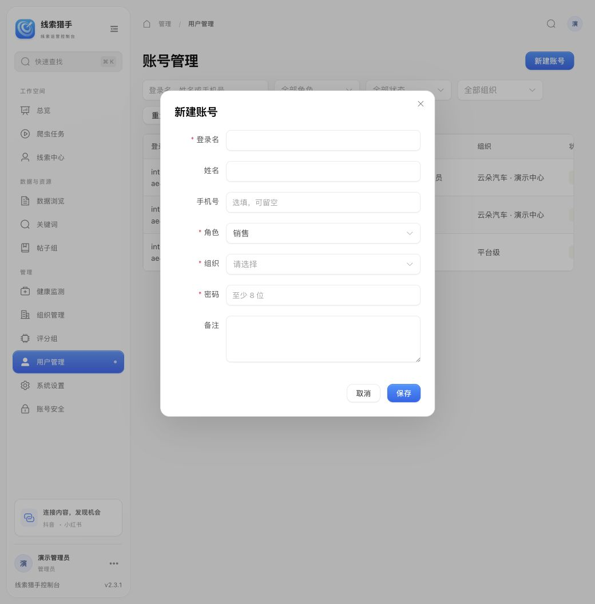

*圖 10｜帳號設定：選擇「銷售」角色及所屬組織，帳號就與具體門店關聯。新建帳號的密碼至少 8 位。*

完成後，檢查帳號處於啟用狀態，並確認組織仍有可用帳號名額。

### 4.4 建組，並綁定接收線索的人

進入 **關鍵詞 / 競品配置 / 帖子組** 中的目標頁面，在上方點 **新建組**。

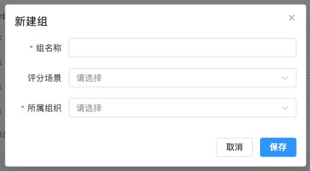

*圖 11｜以帖子組為例：填寫組名稱並選擇所屬組織。目前評分模型由組織綁定的評分組決定，留空繼承平台預設；由平台管理員確認。組名建議能看出門店、車型或用途，方便後續篩選和復盤。 （2026-09-08 歷史介面示例）*

建組後，在該組的 **接收帳號** 下拉選單選擇接收人，再點 **儲存帳號**。關鍵詞頁面圖 04 展示了這一位置。

**檢查結果**：該組資料列中能看到預期接收帳號，組所屬組織正確。儲存後用於後續分發，也會補發先前因未配置分發人而阻塞的線索；已有投遞不會撤回，也不會將所有歷史線索自動轉給新人。

### 4.5 新增關鍵詞：找到車型與需求討論

進入 **關鍵詞 → 新增關鍵詞**。

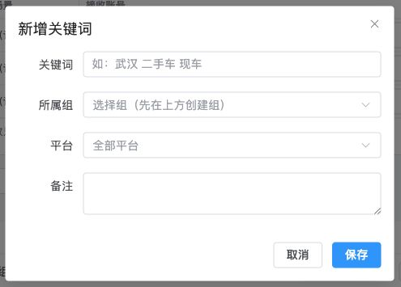

*圖 12｜關鍵詞設定：填寫搜尋詞、選擇已建立的組和平台，備註可記錄該詞的業務目的，例如「本地落地價諮詢」。 （2026-09-08 歷史介面示例）*

1. 填入搜尋詞，例如「長沙 小鵬 落地」。
2. 選擇對應關鍵詞組。
3. 選擇平台；「全部平台」當前為抖音與小紅書，TikTok 需單獨選擇。
4. 儲存後，在清單中檢查搜尋頁數、評論頁數與上次搜尋時間。

擴大頁數會擴大本次搜尋範圍，也會增加處理量。建議先檢查少量結果是否相關，再按效果調整。

### 4.6 新增競品帳號：覆蓋目標作品評論

進入 **競品配置 → 新增競品**。

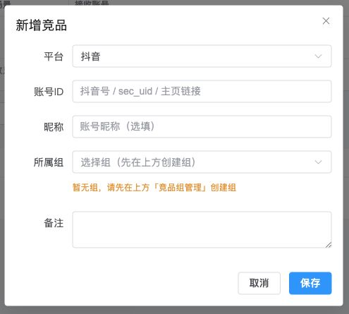

*圖 13｜競品設定：選擇平台後，按頁面提示填寫帳號標識；抖音示例支援抖音號、sec_uid 或主頁連結。先建競品組，再選擇所屬組。 （2026-09-08 歷史介面示例）*

填寫帳號標識、可選暱稱、所屬組與備註，儲存後檢查帳號是否出現在清單。各平台的帳號格式以對應表單提示為準。

競品組適合圍繞明確的公開帳號持續觀察；關鍵詞組適合圍繞主題發現內容。兩種入口可以配合使用。

### 4.7 新增帖子關鍵詞：尋找主動求購帖

進入 **帖子組**，先建立帖子組並確認所屬組織，再點 **新增關鍵詞**。填寫搜尋詞、選擇帖子組和搜尋頁數，儲存後檢查清單。

結合圖 06，可將「城市 + 品牌 + 蹲銷售 / 現車 / 選車」等作為起點。使用者帖子中可能同時包含使用場景、換車原因和車型比較，銷售應閱讀全文後判斷能否服務。

### 4.8 啟用採集，檢查任務進度

組頁面顯示固定的 **每天 00:00** 採集安排。日常營運需要檢查組是否啟用、配置是否正確，以及是否已綁定接收帳號。

系統管理員還能使用 **搜尋評論 / 監控 / 搜尋帖子** 等手動入口。手動執行的兩種選擇含義不同：

| 執行方式 | 實際用途 |
|---|---|
| 指派並分發 | 對整組建立批次，完成後按規則和配額進入指派分發流程 |
| 僅本次搜尋 | 只採當前條目，用於查看搜尋結果，本次不進入指派分發流程 |

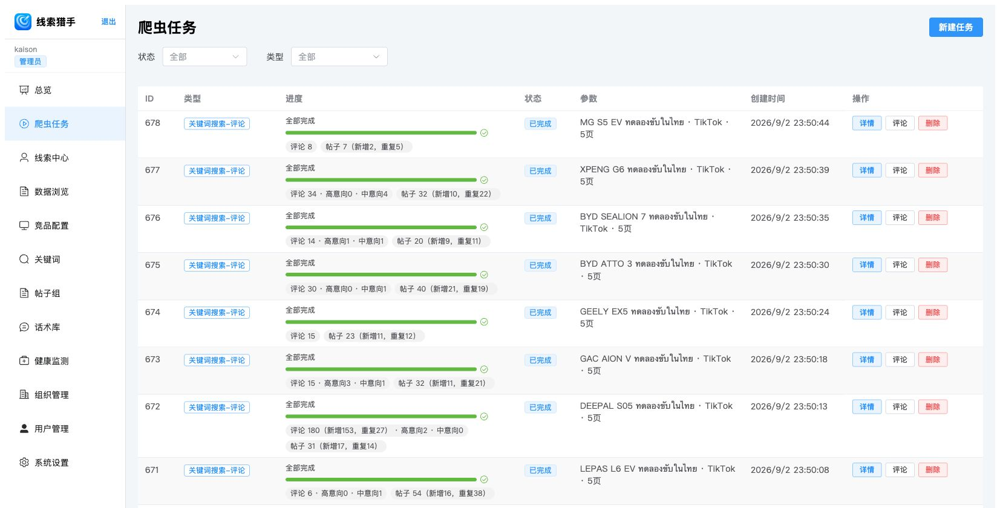

*圖 14｜系統管理員可在「爬蟲任務」查看完成狀態、內容和評論數量、重複紀錄以及高、中意向結果，及時掌握採集和分析進度。 （2026-09-08 歷史介面示例）*

若任務出現異常，進入詳情查看原因；處理完成後，繼續檢查組織指派和帳號分發結果。

### 4.9 在線索中心篩選，查看判斷依據

進入 **線索中心**，選擇自己有權限的池視圖，按線索類型、平台和意向篩選；需要時展開 **進階篩選**，補充組、城市、時間等條件，再點 **查詢**。

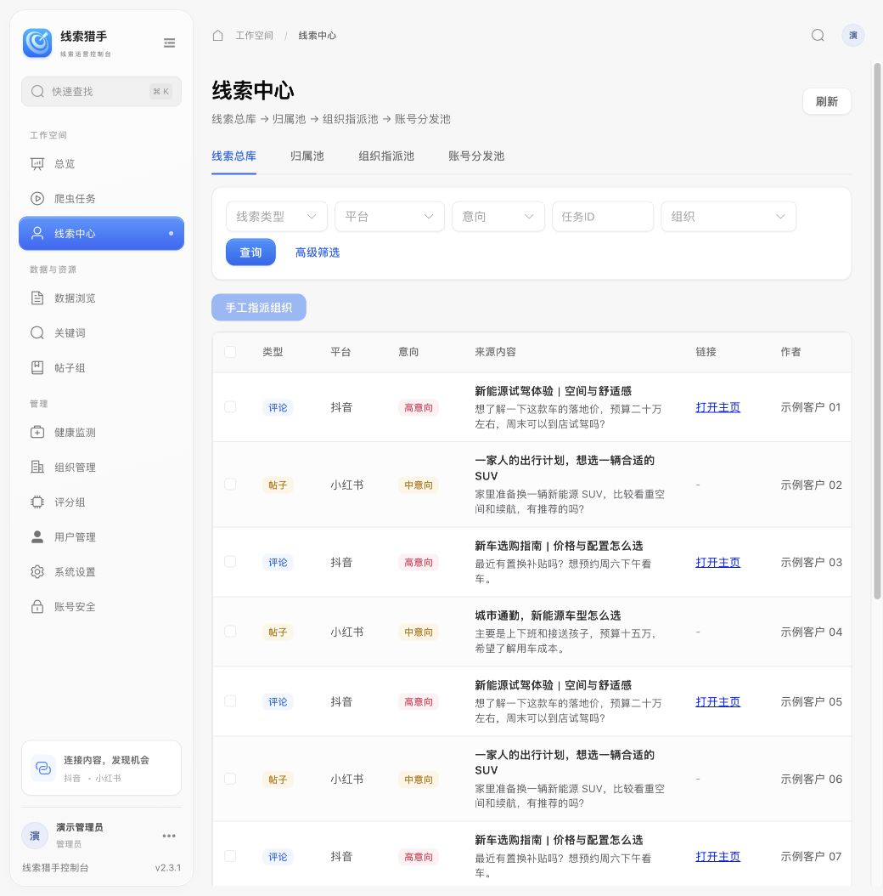

*圖 15｜管理員總庫視角：同一清單可以看到帖子與評論，來源連結可幫助回看上下文，三池計數可幫助判斷是否已經進入分配流程。經銷商管理員在本組織池中完成相應工作。*

點 **詳情** 後，重點閱讀原文、帖子標題、意向、評分判斷與建議動作。圖 07 展示了詳情中的主要業務資訊。

銷售優先查看高意向線索，並結合客戶當前需求、地區和車型判斷跟進方式；已經處理或需求不匹配的內容，可按門店流程分類管理。

### 4.10 把組織線索分給銷售

進入 **組織指派池**，找到有效的指派紀錄，點擊 **分發帳號**。

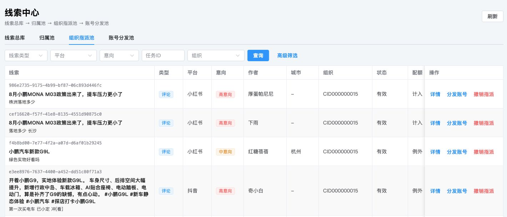

*圖 16｜門店分發工作臺：查看線索、平台、意向、組織和狀態，右側「分發帳號」用於指定接收人。 （2026-09-08 歷史介面示例）*

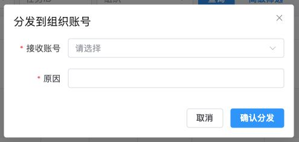

*圖 17｜分發視窗：選擇本組織的接收帳號並填寫原因，檢查無誤後確認分發。 （2026-09-08 歷史介面示例）*

完成後，進入 **帳號分發池** 檢查有效分發紀錄，並請接收人用自己的 APP 帳號確認可見。

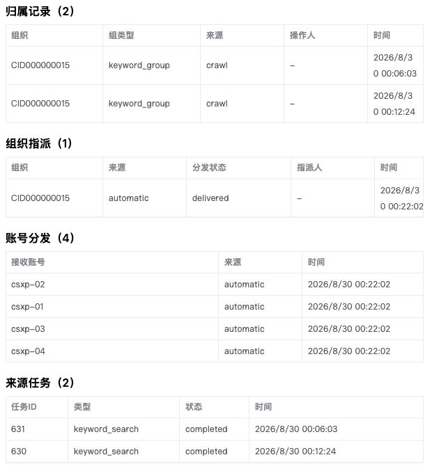

*圖 18｜流轉追溯：詳情中能看到歸屬、組織指派、帳號分發與來源任務。透過流轉紀錄查看線索交給了哪些帳號，並明確主跟進銷售，避免重複溝通。 （2026-09-08 歷史介面示例）*

## 5. APP 怎麼用：查看、篩選、提醒與跟進

### 5.1 從應用商店安裝

打開[蘭芯應用商店中的「线索猎手」](https://appstore.lancloudtech.com/app?id=leadshunter)，按手機系統選擇安裝方式。

| 裝置 | 安裝步驟 |
|---|---|
| iPhone | 先安裝 TestFlight，再從商店進入[线索猎手 TestFlight 邀請頁](https://testflight.apple.com/join/Bq2mpgwF)，按提示安裝 |
| Android | 用手機瀏覽器打開商店，點擊「獲取」，按頁面提示完成驗證、下載 APK 並安裝 |
| 電腦 | 可瀏覽介紹與截圖；安裝下載請在對應手機瀏覽器中進行 |

APP 帳號由組織管理員提供。登入時選擇管理員指定的伺服器，再輸入帳號；帳號與伺服器須對應同一組織環境。

### 5.2 打開「線索」，先排處理順序

登入後從底部進入 **線索**，查看分配給自己的內容。優先閱讀高意向，再處理中意向，並結合日期和跟進狀態安排當天工作。

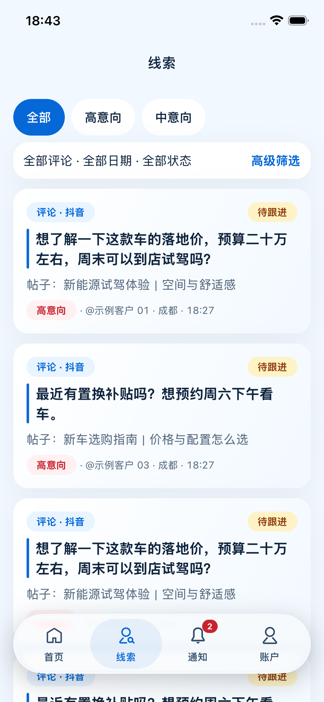

*圖 20｜線索列表：頂部按全部、高意向、中意向切換；卡片展示標題、意向、平台、類型、地區和客戶留言，並用狀態標籤區分待跟進與已跟進。底部可切換首頁、線索和通知。*

先看卡片裡的客戶原話，再結合意向和狀態點入詳情，了解客戶關注的車型與具體問題。

### 5.3 用進階篩選找到當天要處理的內容

點擊 **進階篩選**，按需要設定類型、平台、日期與跟進狀態。

推薦的日常查看順序是：**今天 / 近 7 天 → 待跟進 → 高意向，再查看中意向**。

評論類型下可按抖音、小紅書篩選；切換帖子類型後，平台選項可能隨類型變化。篩選後無結果時，先放寬日期或跟進條件，查看更大範圍的線索。

### 5.4 讀懂評論詳情，再前往主頁或原帖

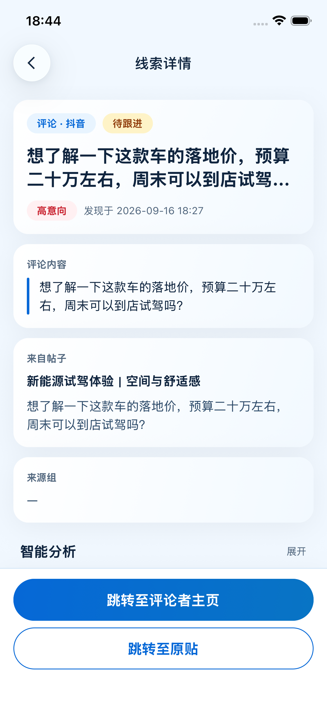

*圖 22｜評論詳情：上方突出客戶提問，下方依次展示評論、原帖標題、帖子內容與來源組。「智慧分析」可展開查看；底部提供「跳轉至評論者主頁」和「跳轉至原帖」。*

1. **看客戶原話**：明確客戶問價格、補貼、配置、交付還是試駕。
2. **看原帖上下文**：確定車型和討論條件，避免答非所問。
3. **展開智慧分析**：有對應結果時，查看判斷依據、建議動作和推薦話術。
4. **前往來源平台**：根據需要進入評論者主頁或原帖，核對最新內容並開展人工溝通。

建議圍繞客戶提出的問題提供幫助。例如，客戶詢問補貼能否疊加時，先核實車型、上牌地區及適用條件，再提供門店確認後的方案。

### 5.5 帖子線索：處理更完整的購車需求

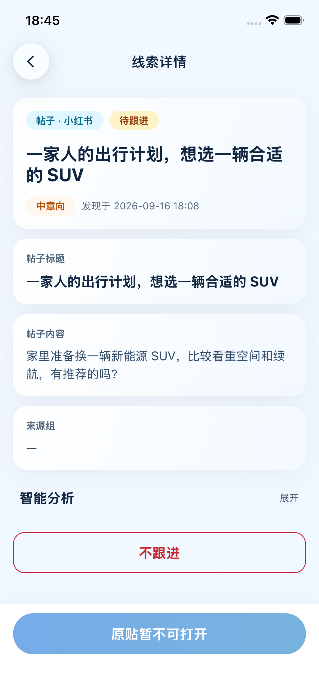

*圖 23｜帖子詳情：使用者主動發帖的標題和正文形成完整需求，銷售可以了解車型、用途及比較問題。目前示例的原帖不可用，因此入口停用；來源有效時可跳轉查看討論。*

帖子通常提供更多語境。跟進時先讀完整正文，再判斷門店能否滿足預算、車型、交付時間或服務地區，圍繞客戶的具體問題準備回應。

### 5.6 處理狀態與通知

適合繼續溝通的線索，從詳情提供的入口前往原平台；不適合繼續處理的線索，可選擇 **不跟進**，再按提示確認。

從詳情的主要跳轉入口前往平台時，APP 會記錄跟進動作，並將線索標記為 **已跟進**。客戶回覆、聯繫方式、到店和訂單進展，可繼續登記在門店台帳或 CRM 中。

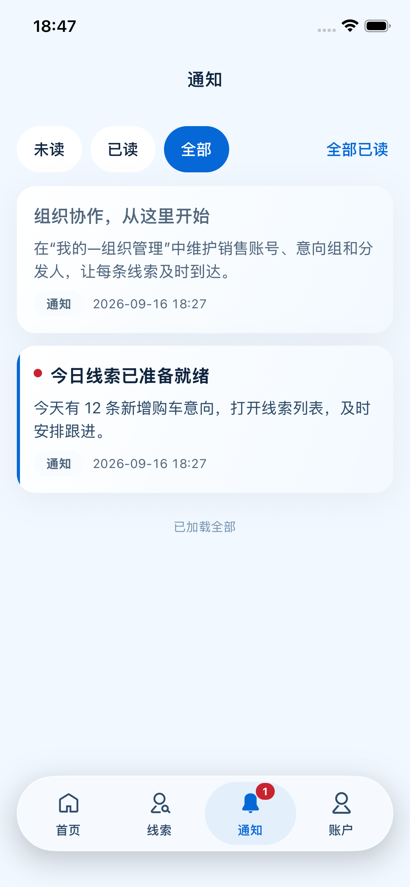

*圖 24｜通知中心：透過未讀、已讀和全部分類查看待辦與提醒，確認後可標記已讀。透過通知及時回到對應線索，安排後續跟進。*

APP 提供新增線索提醒，以及上午、下午的摘要提醒。開啟手機通知權限後，可以更及時地關注待處理線索。

### 5.7 與 DCC 和門店現有流程協同

當客戶在原平台回覆並形成有效溝通後，由銷售或 DCC 按門店流程繼續核實需求、取得客戶願意提供的聯繫方式、預約試駕和安排到店。需要登記 CRM / DCC 時，按門店現有方式完成。

### 5.8 首頁與「帳戶」

首頁顯示 **待跟進** 與 **今日新增**，可直接進入待處理線索；處理詳情後返回，待跟進數字同步更新。底部 **帳戶** 開啟「我的」頁，集中提供帳戶資料、主題、版本、隱私資料及登出；經銷商管理員還可進入 **組織管理**。

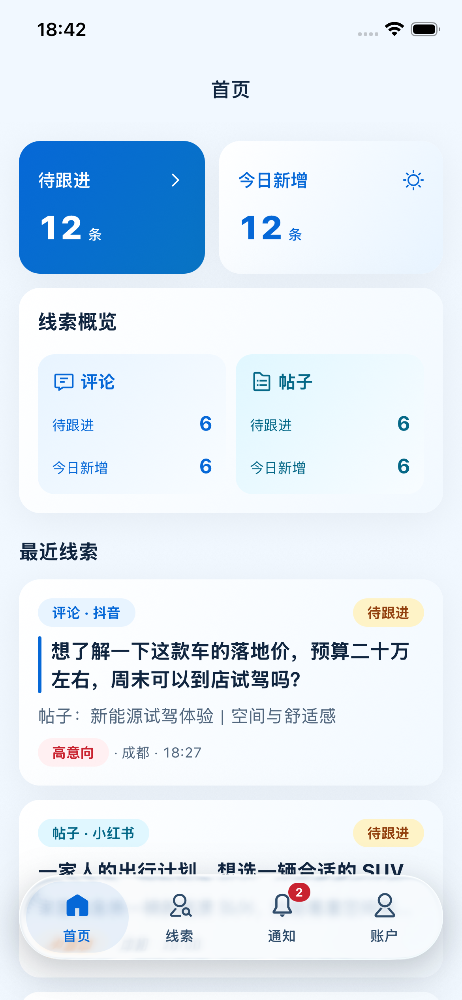

*圖 30｜首頁：待跟進與今日新增，點擊進入需要處理的線索。*

### 5.9 在手機上管理組織帳號與意向組

進入 **帳戶 → 組織管理**，選擇 **組織帳號管理** 或 **意向組管理**。

- **組織帳號管理**：查看已啟用銷售數與上限。開通時填寫姓名、使用者名稱、手機號碼、密碼與備註，其中姓名、使用者名稱及密碼必填。點進帳號詳情可修改姓名、手機號碼和備註；使用者名稱唯讀，現有密碼不可查看，重設新密碼須確認，成功後舊登入工作階段失效。開通和恢復啟用都受組織銷售配額限制。
- **意向組管理**：關鍵詞組和帖子組各有獨立列表；建立後進入詳情維護關鍵詞與分發人。關鍵詞可選擇支援的平台，帖子組使用固定平台；新增受組織配額限制。
- **分發人**：依姓名或使用者名稱搜尋本組織在用帳號，可多選或確認清空。儲存後用於後續分發，也會補發先前因未配置分發人而阻塞的線索；已有投遞不會撤回。

停用帳號會自動移出所有關鍵詞組和帖子組，保留歷史線索、分發與跟進檔案。恢復只啟用帳號，管理員須手動重新加入所需群組；歷史線索仍可依原權限查看。

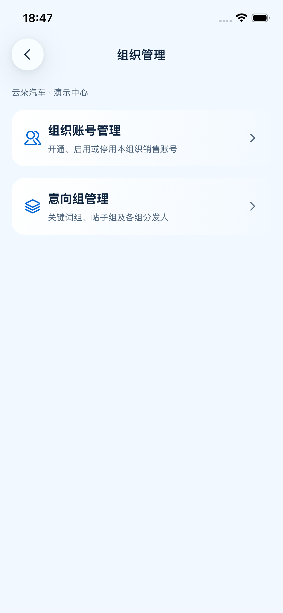

*圖 31｜組織管理：帳號與意向組使用獨立入口。*

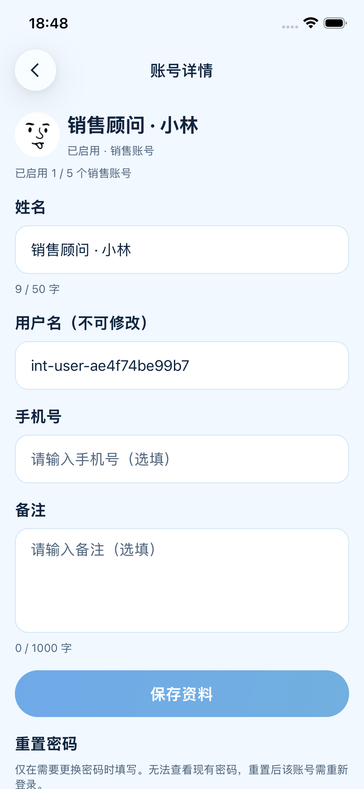

*圖 32｜組織帳號詳情：姓名、使用者名稱、手機號碼、密碼重設與備註；在詳情操作停用或啟用。*

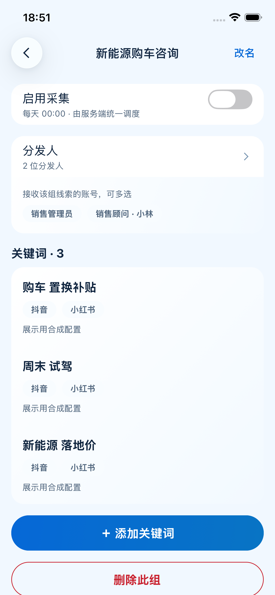

*圖 33｜組詳情：在每個組內分別維護關鍵詞與分發人。*

### 5.10 自助註銷與資料保留

在 **我的 → 註銷帳號** 閱讀說明，輸入目前密碼並確認後，帳號停用並自動移出關鍵詞組和帖子組，裝置回到登入頁。註銷不會自動刪除個人資訊或歷史紀錄，也不代表永久刪除。

平台管理員可恢復帳號；本組織在用的經銷商管理員亦可恢復銷售帳號。最後一位在用經銷商管理員註銷時，組織同時停用，須先由平台管理員恢復組織。恢復不會自動回到原群組。對不再必要的個人資訊，可向營運方或組織管理員申請更正、刪除或匿名化；最後一位在用平台管理員受保護，不能自助註銷。詳見 App 內隱私政策。

## 6. 合作夥伴與使用效果

### 6.1 當前合作夥伴

线索猎手服務國內汽車經銷商、直營門店及海外汽車業務，合作夥伴包括：

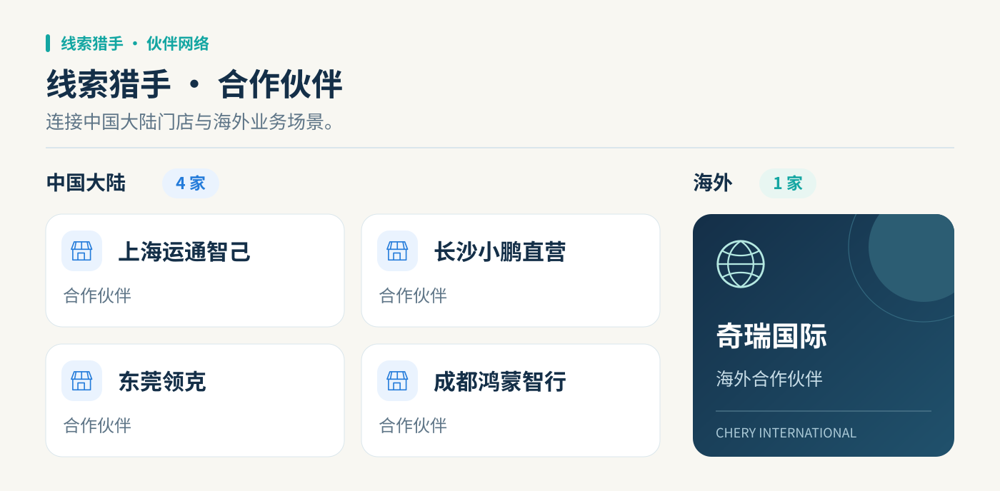

*圖 25｜合作夥伴：中國大陸地區包括上海運通智己、長沙小鵬直營、東莞領克、成都鴻蒙智行；海外合作夥伴為奇瑞國際。*

| 合作區域 | 合作夥伴 |
|---|---|
| 中國大陸 · 上海 | 上海運通智己 |
| 中國大陸 · 長沙 | 長沙小鵬直營 |
| 中國大陸 · 東莞 | 東莞領克 |
| 中國大陸 · 成都 | 成都鴻蒙智行 |
| 海外 | 奇瑞國際 |

### 6.2 長沙小鵬直營：一個月的跟進成果

**從社交平台上的購車討論，到客戶回覆、聯繫方式和鎖單反饋，线索猎手已進入門店的日常銷售工作。** 長沙小鵬直營在一個月的付費試用期間，由長沙雨花、長沙芙蓉天街兩家門店的 4 名銷售跟進小紅書與抖音渠道的線索。

一個月內，台帳記錄了 **174 條跟進、62 條客戶回覆、36 條取得聯繫方式、23 條取得手機號，以及 3 條銷售鎖單反饋**。

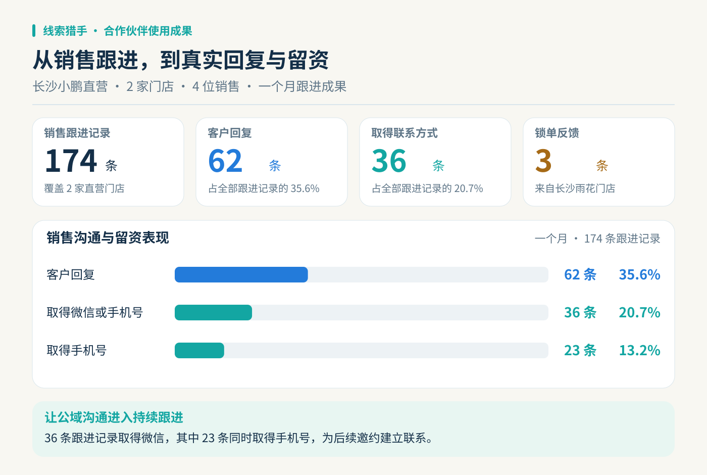

*圖 26｜長沙小鵬直營使用效果：客戶回覆占跟進紀錄的 35.6%，取得聯繫方式占 20.7%，取得手機號占 13.2%。*

| 跟進成果 | 紀錄數 | 占跟進紀錄 | 對門店的價值 |
|---|---:|---:|---|
| 銷售跟進 | 174 條 | 100% | 社交渠道線索進入日常銷售工作 |
| 客戶回覆 | 62 條 | 35.6% | 建立雙向溝通，進一步了解購車需求 |
| 取得聯繫方式 | 36 條 | 20.7% | 取得微信，便於持續溝通和培育 |
| 其中：同時取得手機號 | 23 條 | 13.2% | 為電話溝通、試駕邀約提供聯繫渠道 |
| 銷售鎖單反饋 | 3 條 | — | 跟進台帳中出現鎖單進展 |

### 6.3 兩家門店的使用表現

**長沙雨花**留下 57 條跟進紀錄，其中 33 條獲得回覆、21 條取得聯繫方式，並有 3 條鎖單反饋。**長沙芙蓉天街**留下 117 條跟進紀錄，其中 29 條獲得回覆、15 條取得聯繫方式。

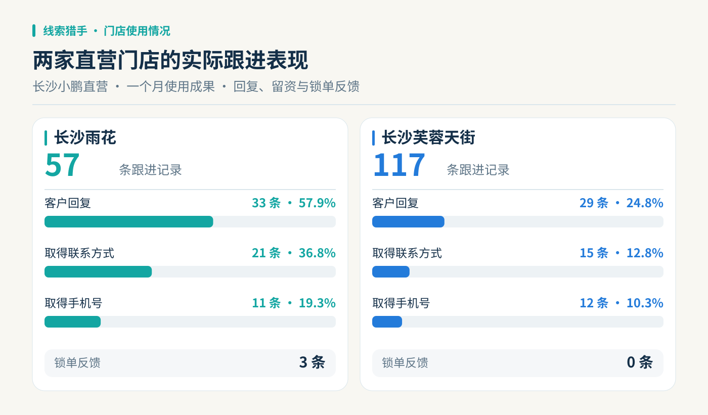

*圖 27｜門店跟進成果：長沙雨花與長沙芙蓉天街均透過社交渠道跟進獲得客戶回應，並取得後續聯繫方式。*

| 門店 | 跟進紀錄 | 客戶回覆 | 取得聯繫方式 | 取得手機號 | 鎖單反饋 |
|---|---:|---:|---:|---:|---:|
| 長沙雨花 | 57 | 33（57.9%） | 21（36.8%） | 11（19.3%） | 3 |
| 長沙芙蓉天街 | 117 | 29（24.8%） | 15（12.8%） | 12（10.3%） | 0 |
| **合計** | **174** | **62（35.6%）** | **36（20.7%）** | **23（13.2%）** | **3** |

本次跟進以小紅書為主：**164 條跟進、61 條回覆、35 條取得聯繫方式、3 條鎖單反饋**。抖音渠道記錄了 **10 條跟進、1 條回覆、1 條取得聯繫方式**。

### 6.4 從客戶回應到鎖單反饋

長沙雨花門店的三條鎖單反饋均來自小紅書。對應跟進紀錄中，銷售已收到客戶回覆，並取得微信和手機號。

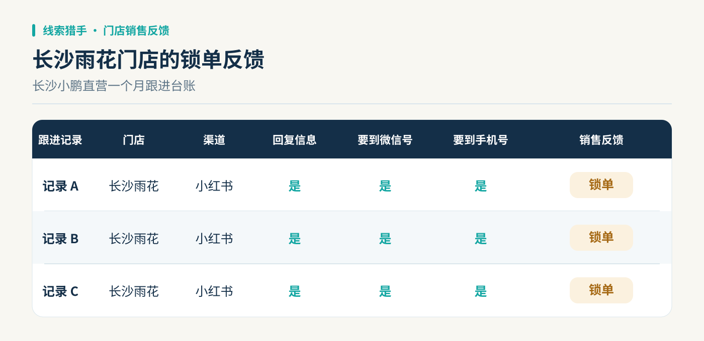

*圖 28｜長沙雨花門店的三條鎖單反饋：銷售透過小紅書開展溝通，取得客戶聯繫方式，並在跟進台帳中記錄鎖單進展。*

長沙案例體現了线索猎手與門店銷售配合的實際價值：

- **拓展客戶接觸渠道。** 在抖音、小紅書等社交場景中發現需求，讓銷售擁有更多主動溝通的機會。
- **把需求討論推進為持續聯繫。** 圍繞客戶原話展開回應，取得聯繫方式後繼續溝通車型、報價和到店安排。
- **讓跟進形成可復盤的結果。** 結合客戶回覆、留資和銷售反饋，持續調整關鍵詞、關注帳號與跟進方式。

## 7. 日常使用清單與常見問題

### 門店首次開通清單

- [ ] 組織已啟用，所在地、帳號上限和各類配額符合約定。
- [ ] 管理員、銷售帳號已建立，人員能使用自己的帳號登入。
- [ ] 關鍵詞組 / 競品組 / 帖子組已設定正確的組織，平台管理員已確認組織使用的評分組。
- [ ] 已選擇接收帳號並點擊「儲存帳號」。
- [ ] 關鍵詞或公開帳號已加入對應組，組處於啟用狀態。
- [ ] 管理員已確認採集與評分完成，並檢查組織指派和帳號分發結果。
- [ ] 接收人已在 APP 中看到對應線索，並能進入詳情查看來源。

### 日常工作建議

| 時間 / 角色 | 建議動作 |
|---|---|
| 上班後 · 銷售 | 查看通知與當天待跟進線索，優先讀高意向內容 |
| 跟進前 · 銷售 | 閱讀原文和上下文，核實車型、地區和當前需求 |
| 跟進中 · 銷售 / DCC | 按平台規則開展溝通，按門店流程記錄有效商機 |
| 每日 · 門店管理員 | 檢查待分發紀錄和接收帳號，明確主跟進負責人 |
| 每週 · 營運人員 | 根據相關性、有效溝通和到店反饋調整關鍵詞與帳號範圍 |

### 常見問題

| 問題 | 排查或理解方法 |
|---|---|
| 後台有線索，APP 卻沒有？ | 區分總庫、歸屬、組織指派、帳號分發；再檢查帳號是否正確、組織和帳號是否啟用、綁定是否生效、配額與篩選條件是否限制了結果。 |
| 明明點了搜尋，為什麼沒有分給銷售？ | 檢查是否選擇了「僅本次搜尋」；該路徑不進入指派分發。還需確認有符合條件的高、中意向結果。 |
| 為什麼一天沒有達到配額？ | 配額是上限，實際數量受採集結果、意向、地區規則和配置影響。 |
| 改了接收帳號，舊線索會自動轉移嗎？ | 已有投遞不會撤回或自動轉移；先前因未配置分發人而阻塞的線索可在配置後補發。 |
| 為什麼沒有看到帖子？ | APP 預設查看評論，打開進階篩選切換「帖子」，並檢查日期和狀態。 |
| 一條線索能給多人嗎？ | 可以；按組綁定或管理員分發，可能由多個帳號接收，需要門店安排具體負責人。 |
| 線索中有哪些客戶資訊？ | 可查看公開評論或帖子、來源連結、意向分析與跟進建議；銷售可回到原平台溝通，取得客戶願意提供的聯繫方式。 |
| 「已跟進」如何使用？ | APP 記錄銷售前往原平台的跟進動作；實際回覆、留資與訂單進展在門店台帳或 CRM 中登記。 |
| 必須先配置話術庫才能使用嗎？ | 不需要。話術庫為可選功能，線索建立、分發與 APP 查看不依賴它。 |
| 海外 TikTok 業務如何開通？ | 聯繫[銷售經理](https://leadshunter-contact.lancloudtech.com/)或平台管理員，配置採集、語言場景、意向規則與交付方式。 |
| 如何了解合作或預約演示？ | 打開[聯繫銷售頁](https://leadshunter-contact.lancloudtech.com/)，或先閱讀[线索猎手官網](https://leadshunter.lancloudtech.com/)上的產品介紹。 |
| 原帖或主頁打不開？ | 檢查對應平台 APP、登入和網路，內容也可能已下架或權限變化。保留線索上下文並回饋管理員。 |

## 8. 聯繫銷售經理

如需了解合作方案、預約產品演示或開通門店試用，可打開[聯繫銷售頁](https://leadshunter-contact.lancloudtech.com/)，或直接使用下方電話、郵件與二維碼。也可以先閱讀[线索猎手官網](https://leadshunter.lancloudtech.com/)上的產品介紹，再約定演示。

| 聯繫方式 | 資訊 |
|---|---|
| 電話 | [+86-17380566771](tel:+8617380566771) |
| 電子郵件 | [lance@lancloudtech.com](mailto:lance@lancloudtech.com) |
| 企業微信 | 長按或掃描下方二維碼，加入銷售經理 |
| 產品官網 | [leadshunter.lancloudtech.com](https://leadshunter.lancloudtech.com/) |

*圖 29｜企業微信：長按或掃描二維碼，加入线索猎手銷售經理。*
