# 线索猎手｜产品介绍与使用说明

> **让公开表达的购车需求，成为门店可以发现、理解和跟进的销售机会。**
>
> 面向汽车经销商、门店负责人、DCC 团队与销售顾问 · 图文版

*图 01｜产品全景：从公开评论、帖子中发现需求，经 AI 判断和后台分配，交付销售在 APP 中查看，再回到原平台开展沟通。*

**快速入口**：[产品官网](https://leadshunter.lancloudtech.com/) · [线索猎手后台](https://aliyun-control-pannel-leadshunter.lancloudtech.com/) · [APP 应用商店](https://appstore.lancloudtech.com/app?id=leadshunter) · [联系销售经理](https://leadshunter-contact.lancloudtech.com/)

## 阅读导航

- [1. 线索猎手是什么](#what)
- [2. 为什么有 DCC 和汽车垂媒，还需要线索猎手](#why)
- [3. 如何扩大经销商的线索入口](#channels)
- [4. 后台怎么用：配置、识别、指派与分发](#console)
- [5. APP 怎么用：查看、筛选、提醒与跟进](#app)
- [6. 合作伙伴与使用效果](#partners) · [长沙小鹏直营一个月案例](#changsha-case)
- [7. 日常使用清单与常见问题](#faq)
- [8. 联系销售经理](#contact)

## 1. 线索猎手是什么

**线索猎手（LeadsHunter）是一套面向汽车经销商和销售团队的公域获客与线索交付工具。** 它帮助门店在抖音、小红书等公开内容中寻找购车需求，用 AI 判断意向、整理上下文和跟进建议，再把适合处理的线索分配给门店与销售顾问。

潜在客户的需求，往往已经写在公开内容里：有人在评论区问“长沙落地多少”，有人询问现车、置换或试驾，也有人直接发帖寻找销售、比较车型。线索猎手把这些分散的需求表达整理成可阅读、可筛选、可分配的工作对象。

| 门店关心的问题 | 线索猎手提供的信息或能力 |
|---|---|
| 哪里还有客户需求？ | 关键词搜索、目标账号作品评论、用户主动发布的需求帖子 |
| 哪些值得优先看？ | 高意向、中意向等 AI 判断及其理由 |
| 客户到底问了什么？ | 评论原文、帖子标题、正文与来源链接 |
| 应该交给谁处理？ | 组织归属、组织指派、账号分发与接收账号配置 |
| 销售下一步怎么做？ | APP 查看详情、参考建议动作、前往用户主页或原帖沟通 |

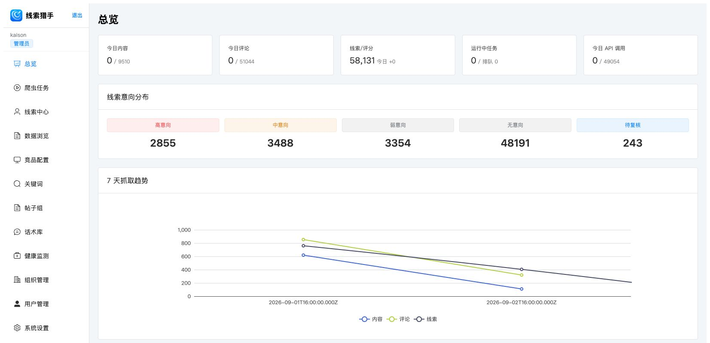

*图 02｜后台总览：上方展示内容、评论、评分和任务概况，中部展示意向分布，下方展示抓取趋势，帮助运营人员掌握需求分布与处理进度。*

### 一套产品，两种工作界面

**后台是运营与分配的工作台。** 管理人员配置关注什么、属于哪家门店、谁接收线索，并检查采集和交付过程。

**APP 是销售顾问的随身线索工作台。** 销售查看分给自己的有效线索，按意向与状态安排优先级，读懂客户需求后回到原平台跟进。

线索猎手帮助门店发现需求、理解意向并安排跟进；销售顾问结合客户原话，继续完成沟通、报价、邀约和成交。

## 2. 为什么有 DCC 和汽车垂媒，还需要线索猎手

**因为客户在走到留资、接听电话和预约到店之前，已经在社交平台表达了大量需求。** 线索猎手为门店增加一个发现这些需求的入口，让原有获客与承接体系有机会覆盖更早的购车讨论阶段。

汽车垂媒带来咨询与留资，DCC 团队负责沟通、培育和邀约。线索猎手补充抖音、小红书等社交平台上的需求发现，让门店在客户主动留资之前就有机会建立联系。

*图 03｜两条入口协同：既有渠道继续承接主动留资，线索猎手补充公域需求发现；销售与 DCC 按门店流程完成沟通和邀约。*

| 维度 | 汽车垂媒等既有渠道 | 线索猎手补充的能力 | DCC / 销售承接 |
|---|---|---|---|
| 发现需求的位置 | 车型内容、咨询、询价与留资路径 | 社交平台公开评论和主动发帖 | 根据客户需求继续沟通 |
| 典型需求表达 | 提交咨询、预约或联系方式 | “多少钱落地”“有没有现车”“求推荐销售” | 核实车型、预算、地区和购车计划 |
| 交给门店的信息 | 咨询、询价与客户留资信息 | 公开原文、来源上下文、意向判断和建议动作 | 报价、邀约、到店与后续跟进 |
| 对经营的作用 | 持续承接已有渠道需求 | 扩大可发现的人群与讨论场景 | 把机会推进为有效商机 |

### 对门店最直接的三个价值

1. **增加发现机会的地方。** 在客户尚未给本店留资时，也能发现其公开表达的需求。
2. **让沟通更有上下文。** 销售先知道客户在问哪个车型、什么问题，再准备回应。
3. **帮助安排跟进顺序。** 从大量内容中筛出高、中意向候选，结合日期和待跟进状态安排工作。

例如，面对一条“落地多少 长沙”的评论，销售可以先通过原帖了解客户关注的车型，准备本地报价与现车信息，再围绕客户的问题展开沟通。**带着上下文联系客户，让每次跟进更有针对性。**

> **长沙小鹏直营使用案例：** 两家门店、4 名销售在一个月的跟进台账中记录了 **174 条跟进、62 条客户回复、36 条取得联系方式，以及 3 条锁单反馈**。[查看门店使用效果](#changsha-case)。

## 3. 如何扩大经销商的线索入口

### 3.1 从“品牌词”扩展到“城市 × 车型 × 需求”

关键词组让门店把经营范围变成可执行的搜索主题。除了品牌名，还可以围绕城市、车型、落地价、试驾、现车、置换等组合配置。

| 搜索思路 | 配置示例 | 希望发现的需求 |
|---|---|---|
| 城市 + 品牌 / 车型 | 长沙 小鹏；上海 智己 | 本地或周边购车讨论 |
| 车型 + 价格 | 某车型 落地价；某车型 优惠 | 询价、预算、成交条件 |
| 城市 + 交付需求 | 东莞 某车型 现车 | 现车、提车周期 |
| 车型 + 用车决策 | 某车型 试驾；某车型 置换 | 体验比较、换购需求 |

运营人员可根据实际回复与留资情况，持续优化城市、车型和需求词的组合。

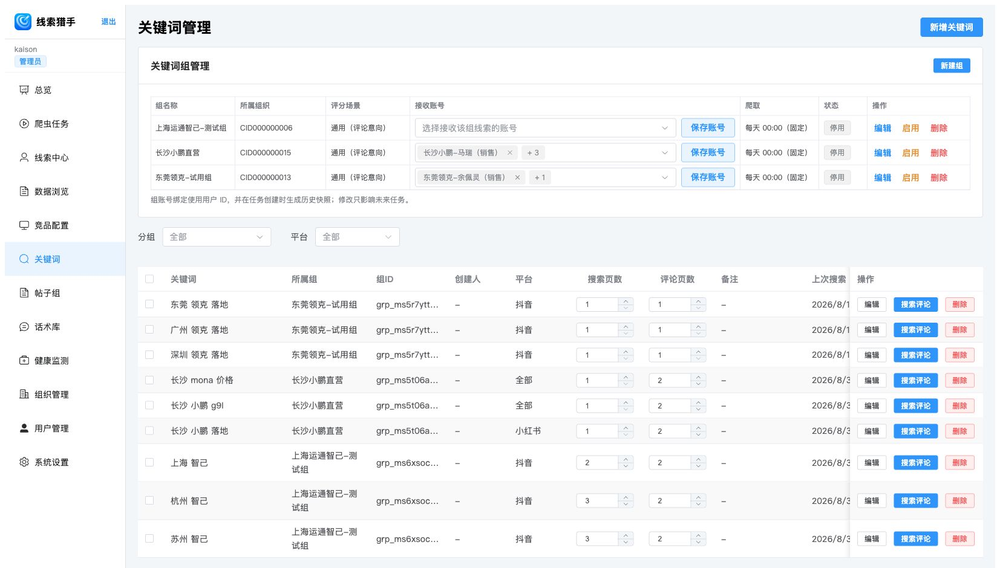

*图 04｜关键词入口：上方管理组、所属组织、评分场景和接收账号，下方维护关键词、平台及搜索范围。围绕“城市 + 品牌 + 落地”等主题配置关键词，启用组后参与定时采集。*

### 3.2 从自己的内容，扩展到目标公开账号的讨论区

“竞品配置”可以围绕选定的公开账号及其作品评论寻找需求。门店可关注与自身经营相关的车型、区域门店或汽车内容账号，发现评论区中正在比较、咨询和询价的潜在客户。

*图 05｜竞品配置：先建组，再添加目标账号，也可通过批量导入快速建立关注账号列表。*

门店可以从这些公开作品和评论中，发现本地购车、车型比较和价格咨询等需求。

### 3.3 从评论区，扩展到主动发帖的求购人群

有些客户不会在门店视频下留言，而是自己发帖问“有销售吗”“这几款车怎么选”“谁有现车”。帖子组用于寻找这类完整的公开需求表达。

*图 06｜帖子组入口：上方选择组织与帖子评分场景，下方配置搜索词。该入口面向小红书帖子，帮助门店寻找用户主动发布的求购需求。*

### 3.4 从“搜到内容”，推进到“知道为什么值得跟进”

AI 会结合内容与上下文进行意向判断，区分高意向、中意向、弱意向、无意向和待复核，并尽可能提供判断依据和建议动作。高、中意向线索会按组织配置进入自动交付流程，供销售优先处理。

*图 07｜AI 意向分析：结合“落地多少 长沙”的评论和小鹏 MONA M03 原帖，识别本地询价需求，并为销售提供“私信报价 + 邀约到店”的跟进建议。*

### 3.5 从“发现机会”，推进到“交给具体的人”

*图 08｜三层线索池：归属池回答“与哪个组织相关”，组织指派池回答“已交给哪家门店”，账号分发池回答“谁在 APP 里能看到”。门店可据此明确线索归属与跟进责任人。*

配置好门店地区、每日配额和接收账号后，管理员可在线索中心查看交付进度，销售在 APP 中接收分给自己的线索。

### 当前平台范围

| 能力 | 当前范围 |
|---|---|
| 关键词评论采集、竞品账号采集 | 页面支持抖音、小红书、TikTok；关键词的“全部平台”当前指抖音与小红书 |
| 帖子组 | 仅小红书帖子 |
| 国内标准自动指派与分发 | 抖音评论、小红书评论、小红书帖子中的高 / 中意向，按组织配置执行 |
| 海外场景 | 已有 TikTok 采集入口；语言场景、意向规则与具体交付方式按海外项目配置 |

## 4. 后台怎么用：配置、识别、指派与分发

建议首次按这个顺序开通：**组织与账号 → 建组 → 绑定接收人 → 添加关键词或账号 → 启用采集 → 检查线索 → APP 接收。**

### 4.1 登录后台，先确认自己的角色

使用组织分配的账号登录[线索猎手后台](https://aliyun-control-pannel-leadshunter.lancloudtech.com/)。左侧菜单随角色变化，普通销售主要使用 APP。

| 角色 | 主要工作 | 可见范围 |
|---|---|---|
| 系统管理员 | 配置组织、配额、账号；检查任务；管理线索总库和三层池 | 平台管理范围 |
| 经销商管理员 | 维护本组织采集组、关键词和接收人；把组织线索分给销售 | 本组织范围 |
| 销售顾问 | 在 APP 阅读线索、筛选、查看通知和跟进 | 分给自己的有效线索 |

经销商管理员主要使用“组织指派池”和“账号分发池”，管理本店线索与销售接收情况。

### 4.2 系统管理员：建立组织，设置接收能力

进入 **组织管理 → 新建组织**，填写组织名称、销售账号上限、所在地等信息，并按业务约定配置每日配额。

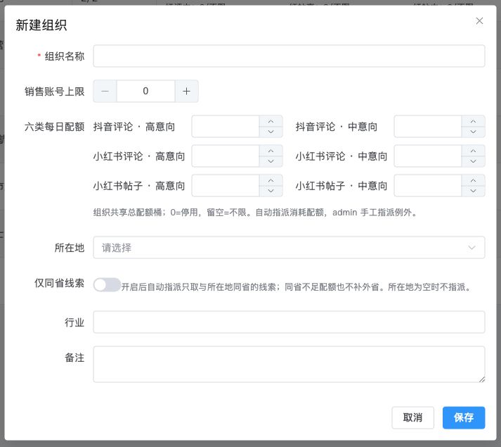

*图 09｜组织设置：销售账号上限限制组织可启用的销售账号数量；六类每日配额分别对应抖音评论、小红书评论、小红书帖子的高、中意向。*

| 设置项 | 如何理解 |
|---|---|
| 六类每日配额 | 按组织共享额度执行 |
| 配额填写 0 | 该类自动指派停用 |
| 配额留空 | 该类不设数量上限 |
| 配额填写正数 | 该类每日自动指派上限 |
| 仅同省线索 | 开启后自动指派只取同省线索；不足时不补外省，所在地为空时不自动指派 |

可根据门店的销售人数与每日承接能力设置配额，并结合跟进情况调整。

### 4.3 建立销售账号

进入 **用户管理 → 新建账号**，填写登录名、姓名、角色、组织和密码。销售账号交付给对应人员使用；经销商管理员只能在本组织范围内创建销售账号。

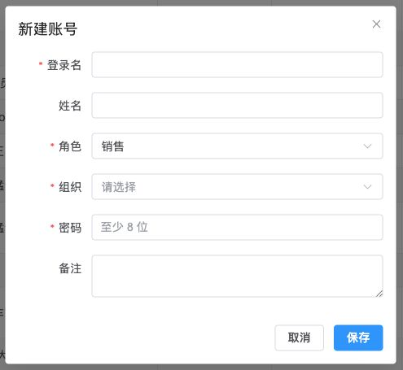

*图 10｜账号设置：选择“销售”角色及所属组织，账号就与具体门店关联。新建账号的密码至少 8 位。*

完成后，检查账号处于启用状态，并确认组织仍有可用账号名额。

### 4.4 建组，并绑定接收线索的人

进入 **关键词 / 竞品配置 / 帖子组** 中的目标页面，在上方点 **新建组**。

*图 11｜以帖子组为例：填写组名称，选择适合业务的评分场景与所属组织；场景不确定时由平台管理员确认。组名建议能看出门店、车型或用途，方便后续筛选和复盘。*

建组后，在该组的 **接收账号** 下拉框选择接收人，再点 **保存账号**。关键词页面图 04 展示了这一位置。

**检查结果**：组行中能看到预期接收账号，组所属组织正确。修改绑定只影响未来创建的任务；历史线索需要在线索中心查看并处理，不会因为改了绑定就全部自动转给新人。

### 4.5 添加关键词：找到车型与需求讨论

进入 **关键词 → 新增关键词**。

*图 12｜关键词设置：填写搜索词、选择已建立的组和平台，备注可记录该词的业务目的，例如“本地落地价咨询”。*

1. 填入搜索词，例如“长沙 小鹏 落地”。
2. 选择对应关键词组。
3. 选择平台；“全部平台”当前为抖音与小红书，TikTok 需单独选择。
4. 保存后，在列表中检查搜索页数、评论页数与上次搜索时间。

扩大页数会扩大本次搜索范围，也会增加处理量。建议先检查少量结果是否相关，再按效果调整。

### 4.6 添加竞品账号：覆盖目标作品评论

进入 **竞品配置 → 新增竞品**。

*图 13｜竞品设置：选择平台后，按页面提示填写账号标识；抖音示例支持抖音号、sec_uid 或主页链接。先建竞品组，再选择所属组。*

填写账号标识、可选昵称、所属组与备注，保存后检查账号是否出现在列表。各平台的账号格式以对应表单提示为准。

竞品组适合围绕明确的公开账号持续观察；关键词组适合围绕主题发现内容。两种入口可以配合使用。

### 4.7 添加帖子关键词：寻找主动求购帖

进入 **帖子组**，先建帖子组并配置评分场景，再点 **新增关键词**。填写搜索词、选择帖子组和搜索页数，保存后检查列表。

结合图 06，可将“城市 + 品牌 + 蹲销售 / 现车 / 选车”等作为起点。用户帖子中可能同时包含使用场景、换车原因和车型比较，销售应阅读全文后判断能否服务。

### 4.8 启用采集，检查任务进度

组页面显示固定的 **每天 00:00** 采集安排。日常运营需要检查组是否启用、配置是否正确，以及是否已绑定接收账号。

系统管理员还能使用 **搜索评论 / 监控 / 搜索帖子** 等手动入口。手动执行的两种选择含义不同：

| 执行方式 | 实际用途 |
|---|---|
| 指派并分发 | 对整组建立批次，完成后按规则和配额进入指派分发流程 |
| 仅本次搜索 | 只采当前条目，用于查看搜索结果，本次不进入指派分发流程 |

*图 14｜系统管理员可在“爬虫任务”查看完成状态、内容和评论数量、重复记录以及高、中意向结果，及时掌握采集和分析进度。*

若任务出现异常，进入详情查看原因；处理完成后，继续检查组织指派和账号分发结果。

### 4.9 在线索中心筛选，查看判断依据

进入 **线索中心**，选择自己有权限的池视图，按线索类型、平台和意向筛选；需要时展开 **高级筛选**，补充组、城市、时间等条件，再点 **查询**。

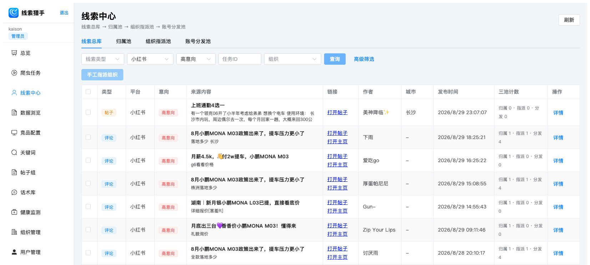

*图 15｜管理员总库视角：同一列表可以看到帖子与评论，来源链接可帮助回看上下文，三池计数可帮助判断是否已经进入分配流程。经销商管理员在本组织池中完成相应工作。*

点 **详情** 后，重点阅读原文、帖子标题、意向、评分判断与建议动作。图 07 展示了详情中的主要业务信息。

销售优先查看高意向线索，并结合客户当前需求、地区和车型判断跟进方式；已经处理或需求不匹配的内容，可按门店流程分类管理。

### 4.10 把组织线索分给销售

进入 **组织指派池**，找到有效的指派记录，点击 **分发账号**。

*图 16｜门店分发工作台：查看线索、平台、意向、组织和状态，右侧“分发账号”用于指定接收人。*

*图 17｜分发窗口：选择本组织的接收账号并填写原因，检查无误后确认分发。*

完成后，进入 **账号分发池** 检查有效分发记录，并请接收人用自己的 APP 账号确认可见。

*图 18｜流转追溯：详情中能看到归属、组织指派、账号分发与来源任务。通过流转记录查看线索交给了哪些账号，并明确主跟进销售，避免重复沟通。*

## 5. APP 怎么用：查看、筛选、提醒与跟进

### 5.1 从应用商店安装

打开[兰芯应用商店中的“线索猎手”](https://appstore.lancloudtech.com/app?id=leadshunter)，按手机系统选择安装方式。

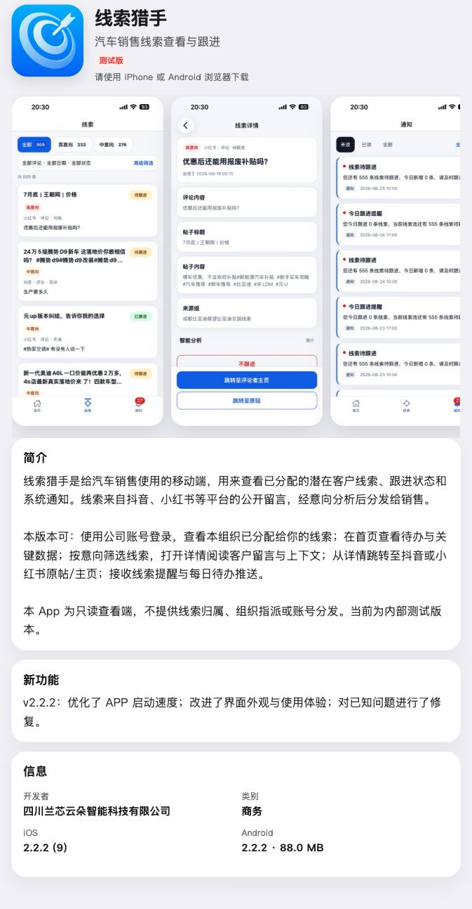

*图 19｜APP 安装入口：在兰芯应用商店查看产品介绍，并按手机系统获取 iOS 或 Android 版本。*

| 设备 | 安装步骤 |
|---|---|
| iPhone | 先安装 TestFlight，再从商店进入[线索猎手 TestFlight 邀请页](https://testflight.apple.com/join/Bq2mpgwF)，按提示安装 |
| Android | 用手机浏览器打开商店，点击“获取”，按页面提示完成验证、下载 APK 并安装 |
| 电脑 | 可浏览介绍与截图；安装下载请在对应手机浏览器中进行 |

APP 账号由组织管理员提供。登录时选择 **南方大区 → 粤港澳服**，并输入管理员提供的账号。若门店使用其他专属服务器，按管理员通知选择。

### 5.2 打开“线索”，先排处理顺序

登录后从底部进入 **线索**，查看分配给自己的内容。优先阅读高意向，再处理中意向，并结合日期和跟进状态安排当天工作。

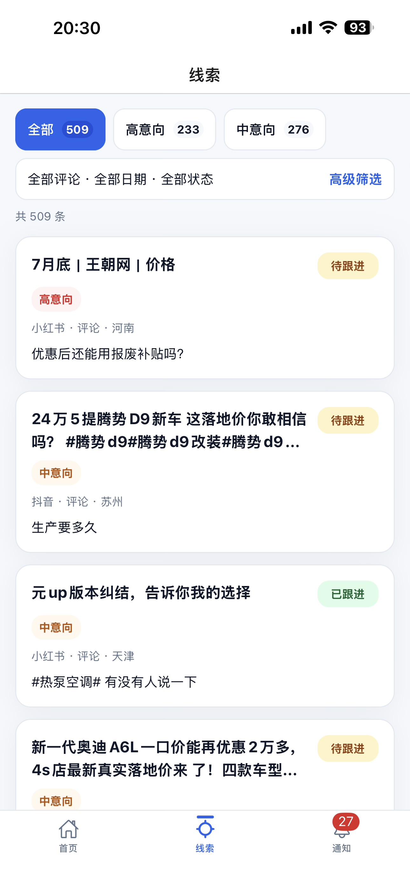

*图 20｜线索列表：顶部按全部、高意向、中意向切换；卡片展示标题、意向、平台、类型、地区和客户留言，并用状态标签区分待跟进与已跟进。底部可切换首页、线索和通知。*

先看卡片里的客户原话，再结合意向和状态点入详情，了解客户关注的车型与具体问题。

### 5.3 用高级筛选找到当天要处理的内容

点击 **高级筛选**，按需要设置类型、平台、日期与跟进状态。

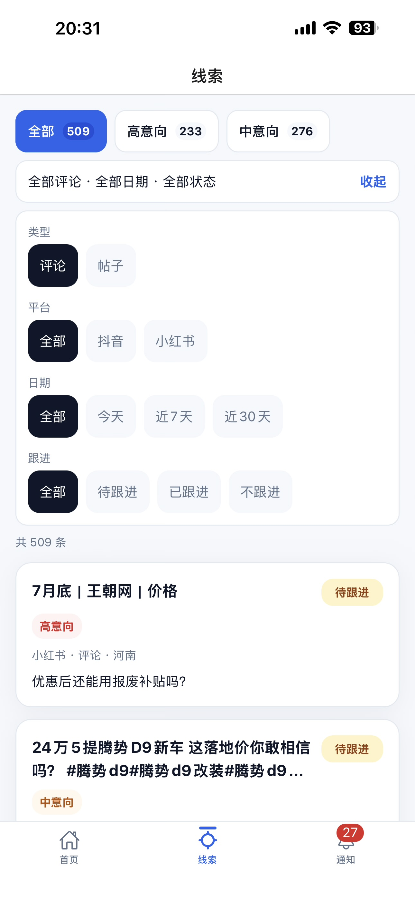

*图 21｜高级筛选：可以把列表缩小到特定类型、平台、时间段和跟进状态。当前默认列表为评论，查看主动求购帖时需要切换到“帖子”。*

推荐的日常查看顺序是：**今天 / 近 7 天 → 待跟进 → 高意向，再查看中意向**。

评论类型下可按抖音、小红书筛选；切换帖子类型后，平台选项可能随类型变化。筛选后无结果时，先放宽日期或跟进条件，查看更大范围的线索。

### 5.4 读懂评论详情，再前往主页或原帖

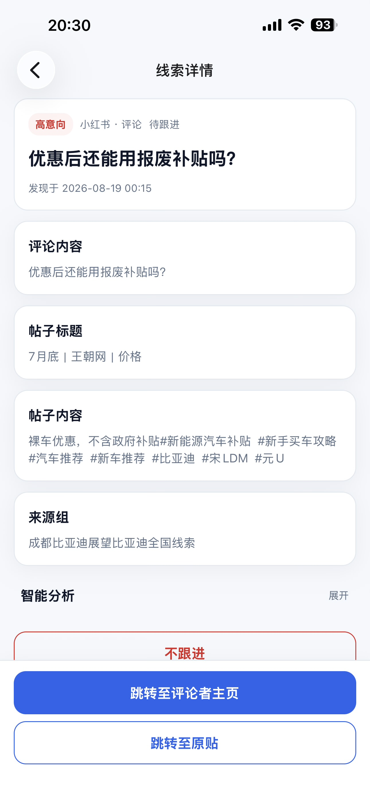

*图 22｜评论详情：上方突出客户提问，下方依次展示评论、原帖标题、帖子内容与来源组。“智能分析”可展开查看；底部提供“跳转至评论者主页”和“跳转至原帖”。*

1. **看客户原话**：明确客户问价格、补贴、配置、交付还是试驾。
2. **看原帖上下文**：确定车型和讨论条件，避免答非所问。
3. **展开智能分析**：有对应结果时，查看判断依据、建议动作和推荐话术。
4. **前往来源平台**：根据需要进入评论者主页或原帖，核对最新内容并开展人工沟通。

建议围绕客户提出的问题提供帮助。例如，客户询问补贴能否叠加时，先核实车型、上牌地区及适用条件，再提供门店确认后的方案。

### 5.5 帖子线索：处理更完整的购车需求

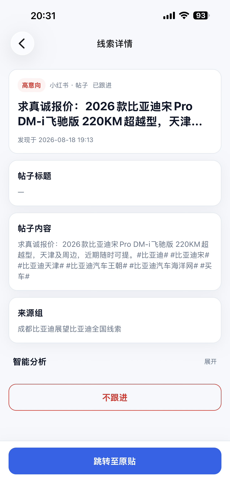

*图 23｜帖子详情：用户主动发帖的标题和正文形成完整需求，销售可以了解车型、用途及比较问题，再点击“跳转至原帖”查看讨论。*

帖子通常提供更多语境。跟进时先读完整正文，再判断门店能否满足预算、车型、交付时间或服务地区，围绕客户的具体问题准备回应。

### 5.6 处理状态与通知

适合继续沟通的线索，从详情提供的入口前往原平台；不适合继续处理的线索，可选择 **不跟进**，再按提示确认。

从详情的主要跳转入口前往平台时，APP 会记录跟进动作，并将线索标记为 **已跟进**。客户回复、联系方式、到店和订单进展，可继续登记在门店台账或 CRM 中。

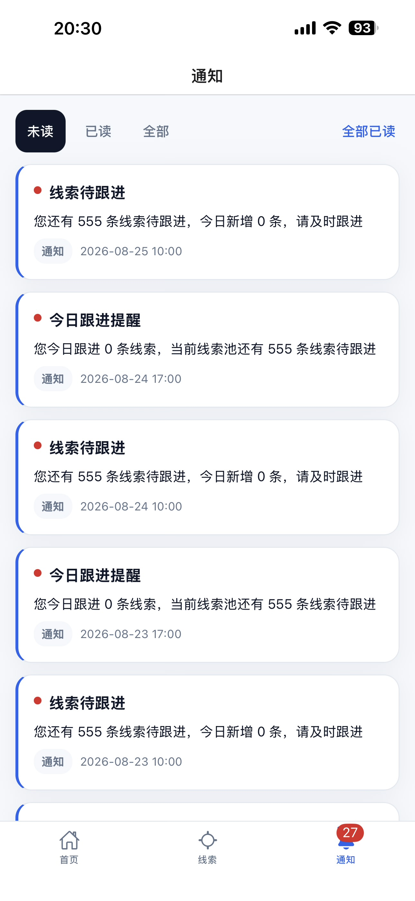

*图 24｜通知中心：通过未读、已读和全部分类查看待办与提醒，确认后可标记已读。通过通知及时回到对应线索，安排后续跟进。*

APP 提供新增线索提醒，以及上午、下午的摘要提醒。开启手机通知权限后，可以更及时地关注待处理线索。

### 5.7 与 DCC 和门店现有流程协同

当客户在原平台回复并形成有效沟通后，由销售或 DCC 按门店流程继续核实需求、取得客户愿意提供的联系方式、预约试驾和安排到店。需要登记 CRM / DCC 时，按门店现有方式完成。

## 6. 合作伙伴与使用效果

### 6.1 当前合作伙伴

线索猎手服务国内汽车经销商、直营门店及海外汽车业务，合作伙伴包括：

*图 25｜合作伙伴：中国大陆地区包括上海运通智己、长沙小鹏直营、东莞领克、成都鸿蒙智行；海外合作伙伴为奇瑞国际。*

| 合作区域 | 合作伙伴 |
|---|---|
| 中国大陆 · 上海 | 上海运通智己 |
| 中国大陆 · 长沙 | 长沙小鹏直营 |
| 中国大陆 · 东莞 | 东莞领克 |
| 中国大陆 · 成都 | 成都鸿蒙智行 |
| 海外 | 奇瑞国际 |

### 6.2 长沙小鹏直营：一个月的跟进成果

**从社交平台上的购车讨论，到客户回复、联系方式和锁单反馈，线索猎手已进入门店的日常销售工作。** 长沙小鹏直营在一个月的付费试用期间，由长沙雨花、长沙芙蓉天街两家门店的 4 名销售跟进小红书与抖音渠道的线索。

一个月内，台账记录了 **174 条跟进、62 条客户回复、36 条取得联系方式、23 条取得手机号，以及 3 条销售锁单反馈**。

*图 26｜长沙小鹏直营使用效果：客户回复占跟进记录的 35.6%，取得联系方式占 20.7%，取得手机号占 13.2%。*

| 跟进成果 | 记录数 | 占跟进记录 | 对门店的价值 |
|---|---:|---:|---|
| 销售跟进 | 174 条 | 100% | 社交渠道线索进入日常销售工作 |
| 客户回复 | 62 条 | 35.6% | 建立双向沟通，进一步了解购车需求 |
| 取得联系方式 | 36 条 | 20.7% | 取得微信，便于持续沟通和培育 |
| 其中：同时取得手机号 | 23 条 | 13.2% | 为电话沟通、试驾邀约提供联系渠道 |
| 销售锁单反馈 | 3 条 | — | 跟进台账中出现锁单进展 |

### 6.3 两家门店的使用表现

**长沙雨花**留下 57 条跟进记录，其中 33 条获得回复、21 条取得联系方式，并有 3 条锁单反馈。**长沙芙蓉天街**留下 117 条跟进记录，其中 29 条获得回复、15 条取得联系方式。

*图 27｜门店跟进成果：长沙雨花与长沙芙蓉天街均通过社交渠道跟进获得客户回应，并取得后续联系方式。*

| 门店 | 跟进记录 | 客户回复 | 取得联系方式 | 取得手机号 | 锁单反馈 |
|---|---:|---:|---:|---:|---:|
| 长沙雨花 | 57 | 33（57.9%） | 21（36.8%） | 11（19.3%） | 3 |
| 长沙芙蓉天街 | 117 | 29（24.8%） | 15（12.8%） | 12（10.3%） | 0 |
| **合计** | **174** | **62（35.6%）** | **36（20.7%）** | **23（13.2%）** | **3** |

本次跟进以小红书为主：**164 条跟进、61 条回复、35 条取得联系方式、3 条锁单反馈**。抖音渠道记录了 **10 条跟进、1 条回复、1 条取得联系方式**。

### 6.4 从客户回应到锁单反馈

长沙雨花门店的三条锁单反馈均来自小红书。对应跟进记录中，销售已收到客户回复，并取得微信和手机号。

*图 28｜长沙雨花门店的三条锁单反馈：销售通过小红书开展沟通，取得客户联系方式，并在跟进台账中记录锁单进展。*

长沙案例体现了线索猎手与门店销售配合的实际价值：

- **拓展客户接触渠道。** 在抖音、小红书等社交场景中发现需求，让销售拥有更多主动沟通的机会。
- **把需求讨论推进为持续联系。** 围绕客户原话展开回应，取得联系方式后继续沟通车型、报价和到店安排。
- **让跟进形成可复盘的结果。** 结合客户回复、留资和销售反馈，持续调整关键词、关注账号与跟进方式。

## 7. 日常使用清单与常见问题

### 门店首次开通清单

- [ ] 组织已启用，所在地、账号上限和各类配额符合约定。
- [ ] 管理员、销售账号已创建，人员能使用自己的账号登录。
- [ ] 关键词组 / 竞品组 / 帖子组已设置正确的组织和评分场景。
- [ ] 已选择接收账号并点击“保存账号”。
- [ ] 关键词或公开账号已加入对应组，组处于启用状态。
- [ ] 管理员已确认采集与评分完成，并检查组织指派和账号分发结果。
- [ ] 接收人已在 APP 中看到对应线索，并能进入详情查看来源。

### 日常工作建议

| 时间 / 角色 | 建议动作 |
|---|---|
| 上班后 · 销售 | 查看通知与当天待跟进线索，优先读高意向内容 |
| 跟进前 · 销售 | 阅读原文和上下文，核实车型、地区和当前需求 |
| 跟进中 · 销售 / DCC | 按平台规则开展沟通，按门店流程记录有效商机 |
| 每日 · 门店管理员 | 检查待分发记录和接收账号，明确主跟进责任人 |
| 每周 · 运营人员 | 根据相关性、有效沟通和到店反馈调整关键词与账号范围 |

### 常见问题

| 问题 | 排查或理解方法 |
|---|---|
| 后台有线索，APP 却没有？ | 区分总库、归属、组织指派、账号分发；再检查账号是否正确、组织和账号是否启用、绑定是否生效、配额与筛选条件是否限制了结果。 |
| 明明点了搜索，为什么没有分给销售？ | 检查是否选择了“仅本次搜索”；该路径不进入指派分发。还需确认有符合条件的高、中意向结果。 |
| 为什么一天没有达到配额？ | 配额是上限，实际数量受采集结果、意向、地区规则和配置影响。 |
| 改了接收账号，旧线索会自动转移吗？ | 不会；绑定变更影响未来任务。历史记录在线索中心处理。 |
| 为什么没有看到帖子？ | APP 默认查看评论，打开高级筛选切换“帖子”，并检查日期和状态。 |
| 一条线索能给多人吗？ | 可以；按组绑定或管理员分发，可能由多个账号接收，需要门店安排具体责任人。 |
| 线索中有哪些客户信息？ | 可查看公开评论或帖子、来源链接、意向分析与跟进建议；销售可回到原平台沟通，取得客户愿意提供的联系方式。 |
| “已跟进”如何使用？ | APP 记录销售前往原平台的跟进动作；实际回复、留资与订单进展在门店台账或 CRM 中登记。 |
| 必须先配置话术库才能使用吗？ | 不需要。话术库为可选功能，线索创建、分发与 APP 查看不依赖它。 |
| 海外 TikTok 业务如何开通？ | 联系[销售经理](https://leadshunter-contact.lancloudtech.com/)或平台管理员，配置采集、语言场景、意向规则与交付方式。 |
| 如何了解合作或预约演示？ | 打开[联系销售页](https://leadshunter-contact.lancloudtech.com/)，或先阅读[线索猎手官网](https://leadshunter.lancloudtech.com/)上的产品介绍。 |
| 原帖或主页打不开？ | 检查对应平台 APP、登录和网络，内容也可能已下架或权限变化。保留线索上下文并反馈管理员。 |

## 8. 联系销售经理

如需了解合作方案、预约产品演示或开通门店试用，可打开[联系销售页](https://leadshunter-contact.lancloudtech.com/)，或直接使用下方电话、邮件与二维码。也可以先阅读[线索猎手官网](https://leadshunter.lancloudtech.com/)上的产品介绍，再约定演示。

| 联系方式 | 信息 |
|---|---|
| 电话 | [+86-17380566771](tel:+8617380566771) |
| 电子邮件 | [lance@lancloudtech.com](mailto:lance@lancloudtech.com) |
| 企业微信 | 长按或扫描下方二维码，添加销售经理 |
| 产品官网 | [leadshunter.lancloudtech.com](https://leadshunter.lancloudtech.com/) |

*图 29｜企业微信：长按或扫描二维码，添加线索猎手销售经理。*
